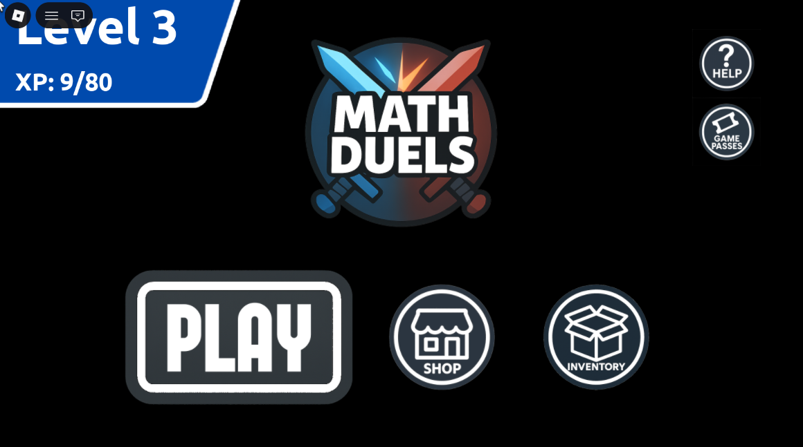

# Math Duels

Math Duels is a multiplayer educational Roblox game where players
compete by solving mathematics problems in real time.

The game has reached **20,000+ plays**.



## Features

- Cross-server matchmaking for Classic and Survival modes
- Reserved-server teleportation for head-to-head matches
- Persistent credits, XP, cosmetics, and equipped items
- Unlockable avatars, banners, and emotes
- Responsive lobby, inventory, and matchmaking interfaces

## Technical Systems

- `MemoryStoreService` for matchmaking queues
- `MessagingService` for cross-server coordination
- `TeleportService` for match server allocation
- `DataStoreService` with retry logic and autosaving
- Client-server communication through Roblox remotes
- Validation of player-data updates

## Repository Structure

```text
place/           Complete Roblox Studio place
src/server/      Matchmaking, persistence, and teleport intake
src/client/      Menu, loading, movement, shop, and game-pass logic
src/shared/      Extracted item configuration
docs/            Architecture, gameplay, and screenshots
