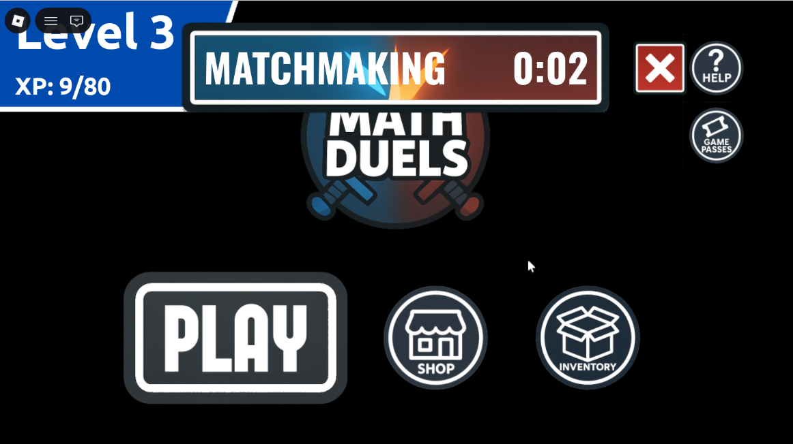
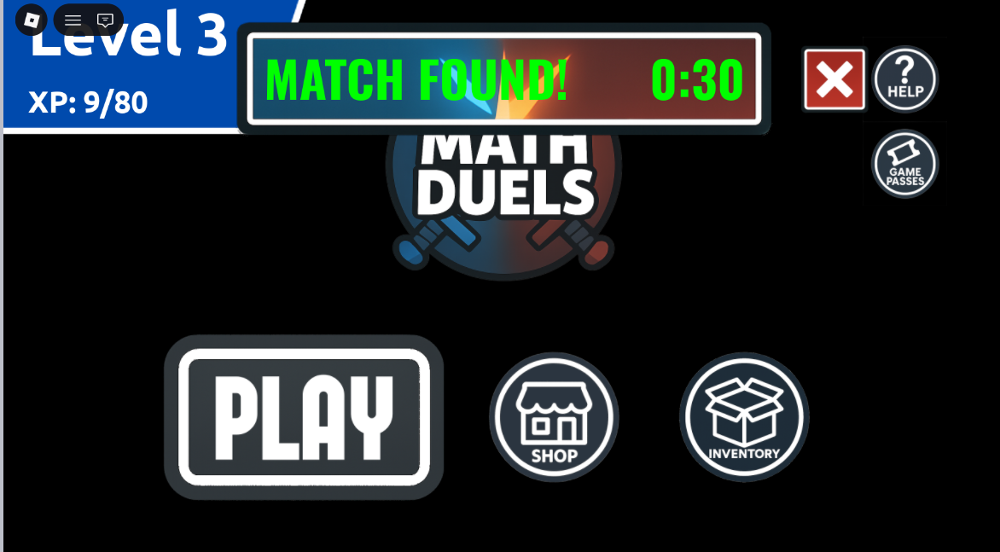
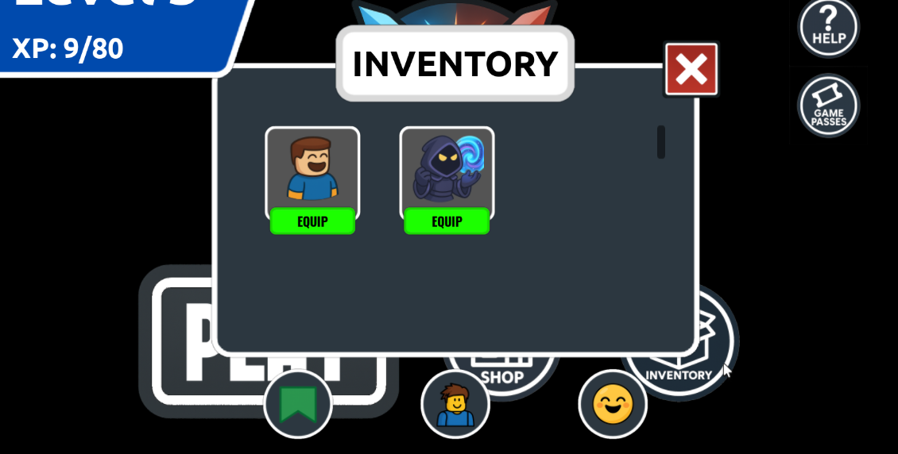

# Gameplay

## Objective

Math Duels is a competitive educational Roblox game where two players solve math problems in real time.

The faster and more accurately a player answers, the more rounds they win.

## Game Flow

1. Join matchmaking.
2. Wait for an opponent.
3. Teleport into a private match.
4. Solve math questions.
5. Earn coins.
6. Purchase new cosmetics.

## Progression

Players unlock

- Avatars
- Banners
- Emotes

using coins earned through gameplay.

## Future Ideas

- Ranked matchmaking
- Daily challenges

## Screenshots

### Main Menu

### Finding a Match

### Match Found

### Inventory

- More question categories
- Seasonal cosmetics
